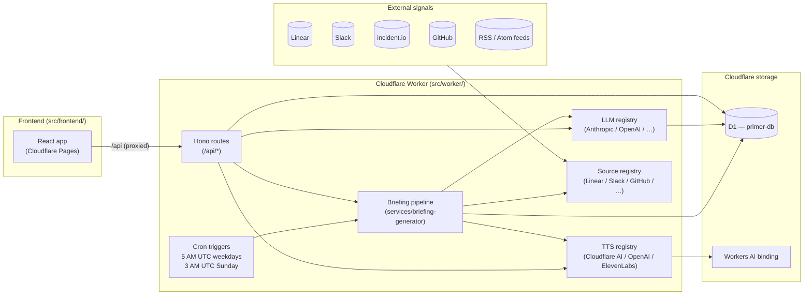
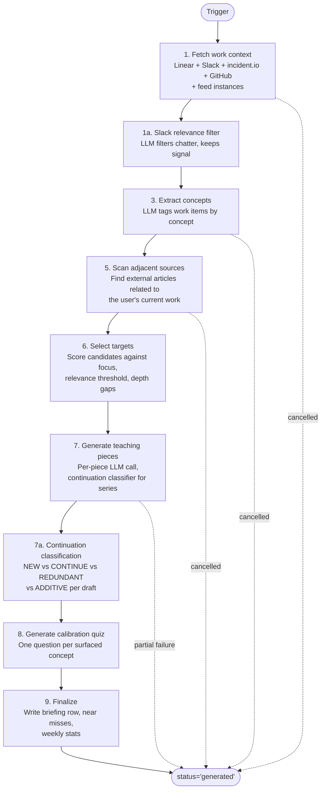

# Primer architecture

This is the 30-second tour of how Primer is wired together. New contributors and AI agents should be able to read this and have a plausible model of the system before opening any code.

## High-level shape



## Briefing pipeline (the main flow)

This is the load-bearing dataflow — what happens when cron (or a manual `/api/briefing/generate`) runs:



Every step writes a `metadata.step` checkpoint to the briefing row before doing real work. That's what powers the **Generation in progress** UI — the frontend polls `/api/briefing/status` every 2s and reads `metadata.step` to render the current pipeline stage.

Cancellation is cooperative: clicking **Cancel** sets `cancel_requested = 1` on the row; each step calls `checkCancelled(briefingId)` at the top of its body and throws `CancelledError` to short-circuit. That's why the dotted "cancelled" arrows above point to the same Done state — the row is finalized either way, just with `status='failed'` and `metadata.reason='cancelled'`.

## The four registries

Primer has four "registry" extension points. New contributors and AI agents adding a feature in one of these areas should pattern-match against the existing entries:

| Registry | File | What it provides | Skill |
|---|---|---|---|
| **LLM adapters** | `src/worker/integrations/llm/dispatcher.ts` | Provider-agnostic `LLMClient` interface used by the pipeline + chat. New providers (OpenAI, Gemini, Mistral) plug in without touching the pipeline. | `.cursor/skills/add-llm-adapter/` |
| **TTS adapters** | `src/worker/integrations/tts/dispatcher.ts` | Same pattern for voice — Cloudflare Workers AI, OpenAI, ElevenLabs all implement `TtsAdapter`. The Voice picker filters by which providers are configured. | `.cursor/skills/add-tts-adapter/` |
| **Source providers** | `src/worker/sources/registry.ts` | Each source (Linear, Slack, GitHub, incident.io, RSS feeds) implements `SourceProvider` with a `fetch` method and a `settingsManifest`. Multi-instance sources (RSS) get one row per instance in the DB. | `.cursor/skills/source-providers/` |
| **Auth providers** | `src/worker/middleware/auth/factory.ts` | `AuthProvider` resolves an authenticated email from the incoming request — `CloudflareAccessProvider` (JWT-verifying) and `DevHeaderProvider` (trusted upstream proxy) ship today. Mode-driven via `PRIMER_AUTH_MODE`. | `.cursor/skills/auth-providers/` |

All four follow the same shape: a registry / factory entry point, an `isAvailable(env)` predicate (so the API only surfaces providers whose secrets are present, where applicable), and lazy construction. Adding a fifth registry-pattern extension point should follow the same template.

## The notification bell + activity indicator

The header has two related but distinct surfaces:

- **Bell** = "needs your attention" — fires for `ready` / `failed` notifications. Numeric red badge for unread counts. Owned by `NotificationBell.tsx`.
- **Activity indicator** = "work in flight, FYI only" — only renders when there's at least one `in_progress` notification. Spinning loader icon, no badge. Owned by `ActivityIndicator.tsx`.

Both share the `useNotifications` hook (single `/api/notifications` poll), so adding the indicator did not double the request rate. The split exists because in-flight work doesn't need the user — conflating it with the bell trained users to ignore the bell.

State machine:

```
in_progress → ready          (success path)
in_progress → failed         (error path / cooperative cancel)
ready/failed → dismissed     (user clicks × in dropdown)
in_progress → failed         (5 min maintenance sweep — stuck rows)
```

See [notifications help doc](../src/frontend/help/reference/notifications.md) for the user-facing contract.

## Auth

Production runs in `cloudflare-access` mode: Cloudflare Access in front of the Pages site authenticates the user, and the worker re-verifies the `Cf-Access-Jwt-Assertion` header against Cloudflare's JWKS (signature + `iss` + `aud` + `exp`) before reading the email claim. An email allowlist (`ALLOWED_EMAIL_DOMAINS` / `ALLOWED_EMAILS`) runs as defense in depth behind the Access policy. See ADR 0006 for the registry shape and `.cursor/skills/auth-providers/` for adding new providers (e.g. for non-Cloudflare deployments behind oauth2-proxy / Pomerium / Tailscale Serve).

The first user to provision a fresh deployment is automatically the admin (atomic check in `worker/middleware/user-context.ts`). Admins can change deployment-wide settings (sources, AI models, voice defaults, budget caps); regular users can only edit personalization (About, Focus, relevance filter). The allowlist check is load-bearing here — it runs inside `provider.authenticate(...)` upstream of the bootstrap INSERT, so a non-allowlisted attacker on a fresh deploy cannot capture admin.

## Where data lives

| Layer | Storage | Notes |
|---|---|---|
| User accounts, settings, notifications, briefings, pieces, concepts, calibration quizzes, usage events | Cloudflare D1 (`primer-db`) | Single-region SQLite. Migrations in `migrations/`. |
| Briefing audio (TTS output) | Streamed direct to client, not persisted | Streamed from `/api/piece/:id/audio` etc. — generated on demand. |
| Source data (Linear issues, Slack messages, …) | Not stored | Re-fetched from upstream APIs on every pipeline run. |
| Cost ledger | `usage_events` table in D1 | Unified across LLM tokens + TTS chars; powers the Analytics page. |

## Where to look for things

When tracing an issue, this is the call-graph order:

1. **Frontend bug?** Start at `src/frontend/pages/<Page>.tsx`. The page uses hooks from `src/frontend/hooks/` for data, components from `src/frontend/components/` for UI.
2. **API behaviour?** Start at `src/worker/routes/<resource>.ts`. The route delegates to a service in `src/worker/services/` for the business logic.
3. **Pipeline behaviour?** Start at `src/worker/services/briefing-generator.ts`. Read top-down — it's organized as the 9 numbered steps from the diagram above.
4. **Auth / user context?** `src/worker/middleware/user-context.ts` resolves `c.get("user")`.
5. **Adapter / provider behaviour?** The three registries: `worker/integrations/llm`, `worker/integrations/tts`, `worker/sources/`.

## Related docs

- [`CONTRIBUTING.md`](../CONTRIBUTING.md) — the contributor workflow.
- [`README.md`](../README.md) — installation, deployment, cost estimates.
- [`dev-docs/adrs/`](./adrs/) — architecture decision records for non-obvious choices.
- `.cursor/skills/` — agent-friendly task-specific guides (adding adapters, routes, pipeline steps, sources).
- `src/frontend/help/` — in-app user-facing docs.
