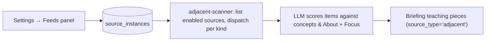

Beyond your direct work signals (Linear, Slack, GitHub, incident.io), Primer scans a set of external feeds — blogs, release notes, newsletters, conference proceedings — looking for items that overlap with concepts you're working on. These supply the **From feeds** pieces in each briefing.

The feed list is **global (deployment-level)** — it applies to all briefings, not per-user. **It starts empty on a fresh deploy.** There's no baked-in curated set; different teams have different interests, and a platform/SRE-flavored default would only have been right for one slice of users. Admins populate the list via the panel below — paste RSS URLs directly, or click ✨ Suggest sources to have Claude propose ~8 candidates tailored to the admin's About + Focus.

## Where to configure

**Settings → Sources → Feeds**. Three workflows:

- **List configured feeds.** Each row shows the feed's label, URL, and kind (RSS / HN / ArXiv). Toggle to enable/disable, click Remove to delete.
- **✨ Suggest sources.** Claude reads your About + Focus statements and proposes ~8 well-known feeds it thinks match your persona. Each is a one-click "Add" card. Suggestions are conservative — only feeds we have high confidence are real and currently active. Won't duplicate anything already configured.
- **Add a source by RSS URL.** Type a label and the feed URL (most blogs publish one at `/feed`, `/rss`, or `/feed.xml`).

## Source kinds

Three kinds are supported:

- **RSS** — generic Atom/RSS feed by URL. Most feeds (blogs, release notes, podcasts, newsletters) work here. Default for manually added sources.
- **HN** — Hacker News best-stories Firebase API. Add via the AI suggester or by manually picking the kind on a custom row.
- **ArXiv** — ArXiv categories (e.g. `cs.DC`, `cs.SE`). Add via the AI suggester or manually; the categories are configurable per row.

For most use cases, RSS is the universal interop and the only kind you'll add manually. HN and ArXiv exist as built-in fetcher implementations the AI suggester can propose when relevant to your About + Focus.

## How feeds flow through the pipeline

## What's NOT supported (yet)

- **Arbitrary URL crawler.** We only fetch feeds that publish RSS/Atom or that we have a dedicated fetcher for (HN, ArXiv). Sites without a feed need either a manual feed-equivalent (your own scraper outputting RSS) or have to wait for a future "URL → LLM extract" mode.
- **Per-user feed lists.** The feed list is deployment-level. All users share the same configured set.
