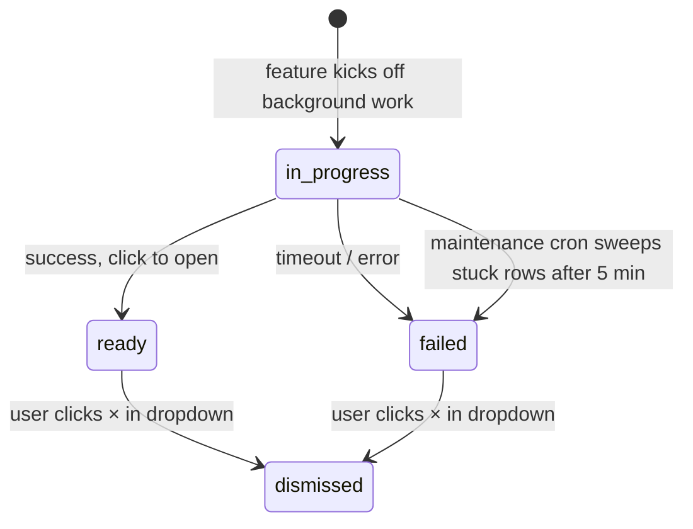

Primer separates background work into two distinct header surfaces so you can tell at a glance which one needs you:

- **Bell** = needs your attention. A briefing is ready, a deep dive finished, something failed. Anything you'd want to click through to or acknowledge.
- **Activity indicator** = work currently in flight. FYI only — nothing for you to do, the system will notify you via the bell when whatever's running actually completes.

The split exists because pre-fix the bell pulsed an accent dot anytime any background work was running, which read as "something needs you" — but in-progress items by definition don't. Now the bell only fires when there's something actionable, and the activity indicator (visible only when work is happening) covers the "is anything running?" question.

## What you'll see

### Bell

- **Empty bell** — nothing actionable, nothing unseen. Default state.
- **Red badge with a number** — completed (or failed) notifications you haven't seen yet. The number caps at `9+` to keep the icon compact.

Click the bell to open the dropdown. Opening it acknowledges every visible row (the red badge clears) but the rows themselves stay until you dismiss them with the small × on hover. The dropdown also exposes a **Mark all as read** button up top whenever there's at least one unread row, so keyboard and screen-reader users can clear the unread count without scrolling through individual rows.

### Activity indicator

A small spinning loader icon, sitting to the left of the bell. **Hidden entirely** when nothing is in flight, so the default header has the bell as the leftmost utility. As soon as work kicks off, it appears with an accent tint and a steady spin — a calm "we're working on it" signal, no urgency.

Click it to open a small "Activity" panel listing every in-flight item with a "Started X min ago" timestamp. Items disappear from this panel and reappear in the bell once they finish (success or failure); the panel itself auto-closes the moment the last in-flight item completes so you're never left staring at an empty popover.

In-flight items are not dismissible from this panel — they resolve to ready/failed automatically, and operation-specific cancel UIs (e.g. the briefing page's Cancel button) own that affordance separately.

## Lifecycle

Each notification flows through a small state machine:

The maintenance cron (Sunday 3 AM UTC) reaps any in-flight notification that hasn't moved for 5+ minutes — the assumption is that the worker died mid-flight and the work isn't coming back. The row flips to `failed` so the bell shows the user that something went wrong instead of leaving them with an indefinite spinner.

## What triggers notifications today

- **Deep dives** (`kind = "deep_dive"`). The moment you click **Go deeper** on a teaching piece, a notification spawns in the in-progress state. You can navigate away — the work continues server-side via Cloudflare's `ctx.waitUntil`. When generation finishes the row transitions to `ready` with a click-through to the deep-dive view; if it fails, the row carries the error message.
- **Baseline calibration** (`kind = "baseline_calibration"`). Clicking **Start calibration** on the Concepts page hits `POST /api/quiz/baseline/prepare`, which spawns an `in_progress` notification and runs question generation under `ctx.waitUntil`. You can navigate away and the bell flips to `ready` with `actionUrl = "/calibrate"` the moment the quiz is ready. The endpoint is idempotent: re-clicking while a row is already in flight is a no-op, and the regular `GET /api/quiz/baseline` short-circuits with `{ generating: true }` instead of kicking off a duplicate generation. See [Baseline calibration → Async preparation](/help/calibration/baseline#async-preparation-you-can-navigate-away).
- **Briefing generation** (`kind = "briefing_generation"`). Triggering a briefing refresh (`POST /api/briefing/generate`) creates an `in_progress` notification and pins the generation work to `ctx.waitUntil`, so navigating away (or closing the tab while the briefing page's streaming response is still open) doesn't kill the run. The bell flips to `ready` with `actionUrl = "/"` when the new briefing lands; if generation fails the row carries the error message, and if you cancel mid-flight the title reads "Briefing generation cancelled" so the bell reflects the actual outcome rather than a generic failure. Re-triggering generate while a row is already in flight dismisses the stale notification and starts a fresh one — there's only ever one `in_progress` briefing notification per user at a time.

More notification kinds will land here without UI changes — the bell renders by `kind`, `title`, `body`, `actionUrl`, and `status`.

## Polling cadence

Both the bell and the activity indicator share a single `useNotifications` hook, so they poll `/api/notifications` together — there's no doubled request rate from running two header surfaces. The cadence is adaptive:

- **4 seconds** while at least one notification is `in_progress` (you should feel the "ready" flip in near-real-time, and the activity panel stays current as items finish).
- **30 seconds** when nothing's running (just keeps the unread count fresh).
- **Paused** when the document is hidden — no point polling a tab the user isn't looking at. Resumes immediately on `visibilitychange`.

So a deep dive that finishes while you're reading another briefing surfaces in the bell within ~4 seconds; a feature that emits a notification while you're on a different app altogether shows up the moment you switch back to Primer.

## Acknowledge vs dismiss

Two distinct actions:

- **Acknowledge** — "I saw this." Clears the unread badge, leaves the row in the dropdown as a record. Happens automatically when you open the dropdown (for everything currently visible) and when you click an individual row.
- **Dismiss** — "Remove this from my list." Click the × on a hovered row. The row is gone from the dropdown forever; the underlying record is kept in the DB with `status = "dismissed"` for analytics, not surfaced anywhere.

## API surface

| Method | Path | Description |
|--------|------|-------------|
| `GET` | `/api/notifications` | Active list (newest 50, status != dismissed) plus `unreadCount` and `inProgressCount`. |
| `POST` | `/api/notifications/:id/acknowledge` | Stamp `acknowledged_at` on a single row. |
| `POST` | `/api/notifications/acknowledge-all` | Stamp `acknowledged_at` on every unread row. Fired implicitly when the dropdown opens with unread > 0. |
| `POST` | `/api/notifications/:id/dismiss` | Flip status to `dismissed`. |

Notifications are *server-emitted* — there's no public POST to create one. Every kind is tied to a specific feature (deep-dive generation today; future briefing/quiz/feed events) that owns the lifecycle.
